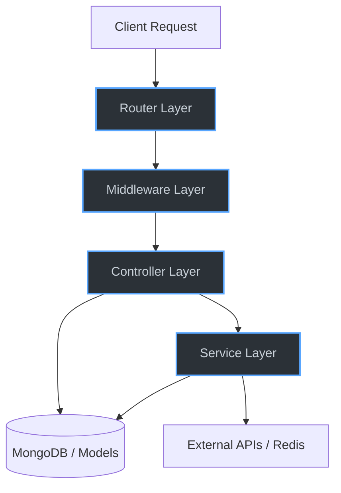

# Architecture

Growcus utilizes a modern, standard layered architecture pattern designed for separation of concerns, scalability, and maintainability.

## Overall Architecture

The application is split into two primary monoliths:
1. **Frontend**: Built with Next.js (React), communicating via REST.
2. **Backend**: Built with Node.js and Express.js.

The backend acts as an API gateway and core processing engine. It connects to:
- **MongoDB**: Primary persistent data store (via Mongoose).
- **Redis**: In-memory caching layer for analytics and session data.
- **Groq API**: External LLM service used by the Aria AI assistant.

## Layered Architecture

The backend strictly enforces the **Controller-Service-Model (CSM)** layered architecture pattern, supported by middleware and routing layers.

### 1. Router Layer (`/routes`)
- **Purpose**: Defines the HTTP API endpoints and maps them to specific controllers.
- **Rules**: Should contain NO business logic. It applies route-specific middleware (like authentication, authorization, and validation).

### 2. Middleware Layer (`/middlewares`)
- **Purpose**: Intercepts requests for cross-cutting concerns.
- **Components**:
  - `auth.js` / `role.js`: Validates JWTs and enforces RBAC (Role-Based Access Control).
  - `validate.js` & `schemas.js`: Validates request bodies against Zod schemas.
  - `rateLimiter.js`: Applies tiered rate-limiting to prevent abuse.
  - `error.js`: Catches errors and formats client-safe responses.

### 3. Controller Layer (`/controllers`)
- **Purpose**: Handles incoming HTTP requests, extracts parameters/body data, invokes services, and sends standard HTTP responses.
- **Rules**: Should delegate heavy business logic to Services. However, in the current Growcus implementation, many controllers handle business logic directly (e.g., risk score calculation). Over time, this should be refactored into the Services layer.

### 4. Service Layer (`/services`)
- **Purpose**: Contains the core business logic of the application. It acts as a bridge between controllers and the database.
- **Usage**: Shared formatting logic (like `studentData.js` formatting for dashboards) or complex orchestrations.

### 5. Data Access Layer (`/models`)
- **Purpose**: Defines MongoDB schemas via Mongoose. Handles data validation, indexing, and relationships at the database level.

## Dependency Graph

- **Controllers** depend on **Models** and **Services**.
- **Routes** depend on **Controllers** and **Middleware**.
- **Middleware** depends on **Config** (for secrets/thresholds) and **Jobs/Utils** (for error formatting).
- **Config** depends on `.env`.

## Data Flow

A typical request flows as follows (see [[Request Flow]] for step-by-step detail):
1. **Express App** receives the request.
2. Global security middleware (Helmet, HPP, CORS) processes it.
3. The specific **Router** catches the route.
4. **Auth/Role Middleware** verifies identity.
5. **Validation Middleware** scrubs input.
6. The **Controller** executes, querying **Models** or invoking **Services**.
7. The **Controller** returns a formatted JSON response via the `sendSuccess` utility.

## Production Considerations

- **Scalability**: The backend is completely stateless (JWT auth, Redis for caching). It can be horizontally scaled using PM2 or Docker/Kubernetes without sticky session issues.
- **Bottlenecks**: Aggregation pipelines (e.g., analytics) might become slow with millions of records. These are currently cached in Redis to mitigate performance hits.
