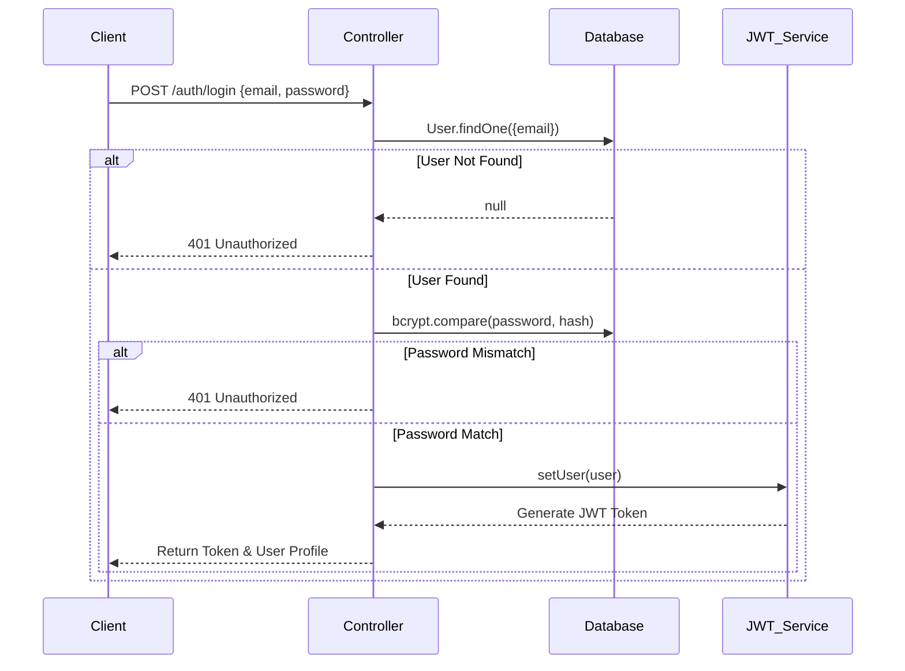

# Authentication

Growcus utilizes a stateless, token-based authentication mechanism using JSON Web Tokens (JWT). This ensures that the backend remains scalable and doesn't require session storage in a database.

## Overview

Authentication is handled via the `auth` controller and secured by custom middleware. The system uses Role-Based Access Control (RBAC) to differentiate between `admin`, `teacher`, and `student` privileges.

## Execution Flow: Login

## Core Components

### 1. `controllers/auth.js`
- **`handleSignUp`**: 
  - Validates input.
  - Checks if user already exists.
  - Creates a new `User` document. Mongoose's `pre('save')` hook automatically hashes the password using `bcryptjs`.
  - Generates a JWT and returns it to the client.
- **`handleLogin`**:
  - Validates credentials.
  - Uses an **Exponential Backoff mechanism** (powered by `express-rate-limit` memory stores or manual tracking) to prevent credential stuffing and brute-force attacks.
  - Issues a JWT upon success.

### 2. `services/auth.js`
- **`setUser(user)`**: Creates the JWT. It signs a payload containing the `_id`, `email`, `role`, and `instituteId`. It requires the `JWT_SECRET` environment variable and enforces an expiration (default `24h`).
- **`getUser(token)`**: Verifies and decodes the JWT. If the token is tampered with or expired, it throws a verifiable error.

### 3. `middlewares/auth.js` (`requireAuth`)
- **Purpose**: Protects private API endpoints.
- **How it works**:
  1. Checks for the `authorization` header (Bearer token) or a `token` cookie.
  2. Passes the token to `getUser()`.
  3. If valid, attaches the decoded payload to `req.user`.
  4. Calls `next()`. If invalid, returns a `401 Unauthorized`.

### 4. `middlewares/role.js` (`allowRoles`)
- **Purpose**: Enforces RBAC on top of authentication.
- **How it works**:
  - Used in route definitions: `router.post('/tasks', requireAuth, allowRoles('teacher', 'admin'), handleCreateTask)`.
  - Checks if `req.user.role` is included in the permitted array.
  - Returns `403 Forbidden` if the user lacks permissions.

## Security Concerns & Hardening

- **Stateless Tokens**: Since JWTs are stateless, there is currently no centralized token invalidation (blacklist) for forced logouts. Tokens live until their `exp` claim expires.
- **Brute Force Protection**: The `/auth/*` endpoints are heavily rate-limited by IP and account identifiers. See [[Security]] for details on the `rateLimiter.js`.
- **Secrets Management**: The backend is programmed to **hard crash** on startup if the `JWT_SECRET` is missing in a production environment, preventing default insecure fallback strings.

---

**Related:**
- [[Middleware/auth]]
- [[Routes/auth]]
- [[Security]]
