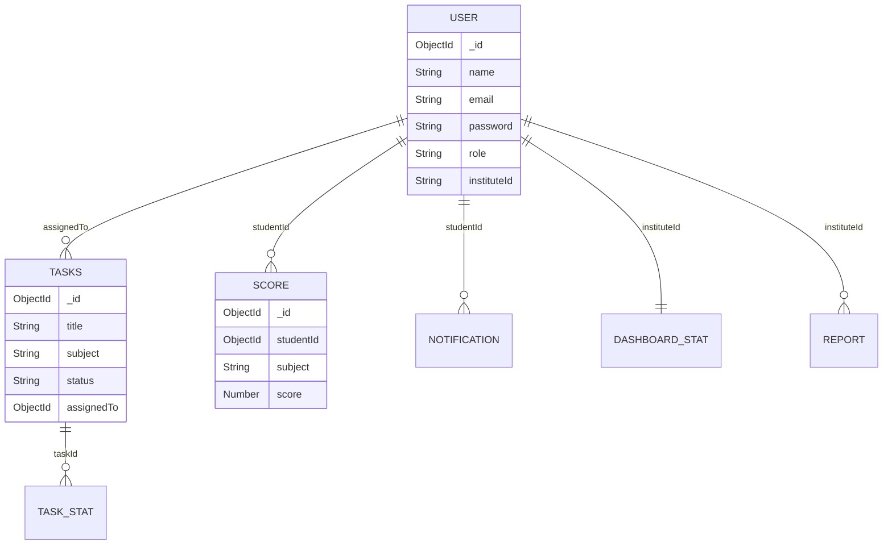

# Database

Growcus uses **MongoDB** as its primary data store, managed via the **Mongoose** ODM (Object Data Modeling) library. The database is highly relational despite being NoSQL, relying on Mongoose `ObjectId` references (population) to tie users, tasks, and analytics together.

## Database Models

The `models/` directory contains all Mongoose schemas. 

### 1. [[Models/User|User Model]]
- **Purpose**: Central identity model holding Admins, Teachers, and Students.
- **Fields**: 
  - `name`, `email`, `password`
  - `role`: (`admin`, `teacher`, `student`)
  - `instituteId`: A string representing the institute/school they belong to.
  - `batch`: For grouping students.
  - `marks`, `attendence`: Aggregated metrics.
  - `tasksCompleted`: Counter.
- **Hooks**: Hashes the password using `bcryptjs` on the `pre('save')` hook.
- **Indexes**: `email` (unique).

### 2. [[Models/Tasks|Tasks Model]]
- **Purpose**: Academic tasks or assignments.
- **Fields**: `title`, `description`, `subject`, `assignedTo` (User ObjectId), `status` (pending, completed), `xp` (experience points).
- **Lifecycle**: Created by a teacher, assigned to a student, status updated by student/teacher, XP awarded upon completion.

### 3. [[Models/Score|Score Model]]
- **Purpose**: Academic test scores for students across various subjects.
- **Fields**: `studentId` (User ObjectId), `subject`, `score`, `instituteId`.
- **Usage**: Queried by the analytics dashboard to calculate class averages and individual student progress curves.

### 4. [[Models/Notification|Notification Model]]
- **Purpose**: Alerts sent to students (e.g., risk alerts, new tasks).
- **Fields**: `studentId` (User ObjectId), `message`, `type` (info, success, warning, error).
- **Usage**: Polled or fetched by the frontend to display dropdown alerts.

### 5. [[Models/DashboardStat|DashboardStat Model]]
- **Purpose**: Cached aggregations for an entire institute to prevent heavy re-calculations on every page load.
- **Fields**: `instituteId`, `totalStudents`, `totalTasks`, `avgScore`.
- **Update Mechanism**: Kept in sync via the `utility/updateDashBoardStat.js` background worker/helper.

### 6. [[Models/Riskscore|Riskscore & Intervention Models]]
- **Purpose**: AI/Algorithm-generated risk metrics determining if a student is likely to fail or drop out.
- **Fields**: `studentId`, `riskLevel` (low, medium, high), `factors`. `Intervention` tracks actions taken by teachers to mitigate the risk.

## Querying and Lifecycle

Most queries are performed inside the `controllers` or `services`. 
- **Population**: Because Growcus uses referenced documents rather than embedded documents, queries heavily rely on `.populate()`. For example, fetching tasks often involves `.populate('assignedTo', 'name email')`.
- **Validation**: Mongoose schemas provide a baseline validation layer (e.g., `required: true`), but the application primarily relies on strict Zod schemas in the [[Middleware/validate|Validation Middleware]] to prevent bad data from ever reaching Mongoose.

## Production Considerations
- **Indexing**: Currently, MongoDB relies on default `_id` indexes and unique `email` indexes. As the `Tasks` and `Score` collections grow, compound indexes (e.g., `{ assignedTo: 1, status: 1 }`) should be added to maintain performance.
- **Transactions**: Complex operations (like completing a task and updating student XP simultaneously) currently lack MongoDB Session Transactions, which could lead to race conditions under heavy load.

---

**Related:**
- [[Architecture]]
- [[Controllers/Overview]]
