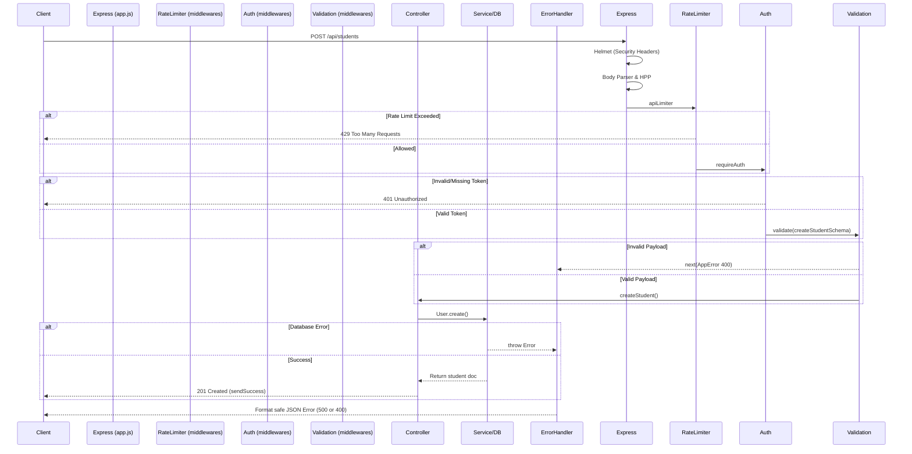

# Request Flow

Understanding the lifecycle of an HTTP request in Growcus is crucial for debugging and extending the API. 

## The Standard Execution Flow

Here is the exact step-by-step journey a request takes when a user interacts with a secure API endpoint.



## Step-by-Step Breakdown

### 1. Global Middleware (`app.js`)
When a request hits `app.js`, it passes through several global layers before reaching any routes:
- **Helmet**: Injects HTTP security headers.
- **Express JSON/URL-Encoded**: Parses the body (limited to `10kb` to prevent payload DOS).
- **HPP**: Protects against HTTP Parameter Pollution.
- **CORS**: Allows the frontend to communicate with the API securely.

### 2. Route & Rate Limiting (`middlewares/rateLimiter.js`)
Based on the URL path, the request is routed and rate-limited:
- `/auth/*` gets `authLimiter` (strict, exponential backoff).
- `/api/*` gets `apiLimiter`.
- `/aria/*` gets `ariaLimiter`.

### 3. Authentication & RBAC (`middlewares/auth.js` & `middlewares/role.js`)
If the route is protected:
- `requireAuth` reads the `authorization` header or HTTP-only cookies to extract the JWT.
- It decodes the JWT using `services/auth.js` -> `getUser()`.
- It injects `req.user` (containing `userId`, `role`, `instituteId`).
- `allowRoles("teacher", "admin")` checks if `req.user.role` is authorized to proceed. If not, it throws a `403 Forbidden`.

### 4. Input Validation (`middlewares/validate.js` & `middlewares/schemas.js`)
To prevent injection and bad data:
- `validate(schema)` runs the incoming `req.body` against a strict Zod schema.
- If extra, unwanted fields are present, they are stripped (or rejected if `.strict()` is used).
- If validation fails, an `AppError` is thrown with specific details, short-circuiting the request directly to the Error Handler.

### 5. Controller Execution (`controllers/*.js`)
- The controller pulls sanitized data from `req.body` and user context from `req.user`.
- It executes business logic (often calling `models` directly or utilizing `services`).
- It wraps all async operations inside `asyncHandler` (from `jobs/asyncHandler.js`), ensuring that if a promise rejects, it is caught automatically.

### 6. Database Interaction (`models/*.js`)
- Mongoose executes the query against MongoDB. 

### 7. Response (`jobs/apiResponse.js`)
- If successful, the controller uses `sendSuccess(res, data, message, statusCode)` to return a normalized JSON payload:
  ```json
  {
    "success": true,
    "message": "Student created",
    "data": { ... }
  }
  ```

### 8. Error Handling (`middlewares/error.js`)
If anything throws an error (or `next(error)` is called) at any step:
- The custom error middleware catches it.
- It checks if the error is `isOperational` (an expected `AppError`).
- It logs the full stack trace server-side for debugging.
- It returns a sanitized JSON response to the client (hiding database stack traces).

---

**Related:**
- [[Error Handling]]
- [[Architecture]]
- [[Security]]
